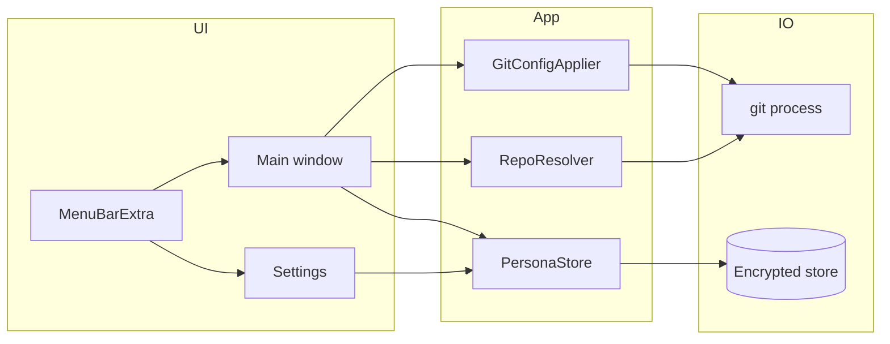
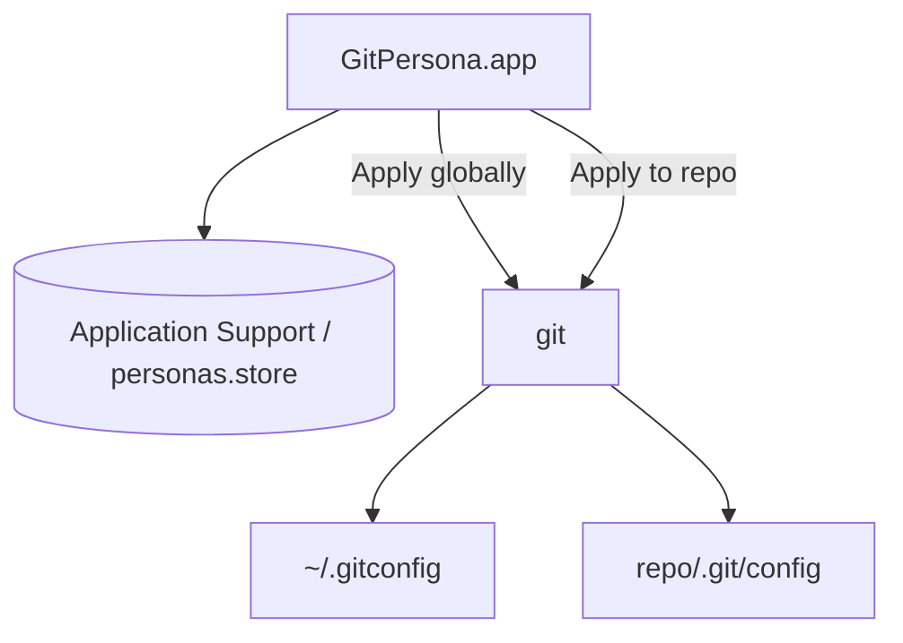

# GitPersona

<p align="center"></p>

<p align="center">
<a href="https://github.com/erbilnas/git-persona/releases"></a>
<a href="https://github.com/erbilnas/git-persona/actions/workflows/build-dmg.yml"></a>
</p>

GitPersona is a macOS menu bar app that switches Git author identity—`user.name`, `user.email`, and optional `user.signingkey`—per repository (local config) or globally (`~/.gitconfig`). Personas are named presets you pick from the menu bar window.

## Requirements

| Requirement | Notes |
|-------------|--------|
| macOS | **26.0** or later (matches deployment target and Liquid Glass APIs) |
| Xcode | **26+** with Swift 6 and macOS 26 SDK, to build from source |
| Git | On your `PATH` (e.g. `/usr/bin/git` or Command Line Tools) |

## Install

GitPersona is **not** on the Mac App Store. Use GitHub releases, CI artifacts, or a local build.

### Releases (recommended)

1. Open [Releases](https://github.com/erbilnas/git-persona/releases).
2. Download `GitPersona-x.y.z.dmg` from a tagged release (e.g. `v1.0.0`). Versioned releases attach the DMG.
3. Open the DMG and drag **GitPersona** into **Applications**.
4. Launch from Applications. The app lives in the **menu bar** only (`LSUIElement`: no Dock icon).

### CI artifacts

Pushes to `main` / `master` and pull requests run [Build DMG](.github/workflows/build-dmg.yml) and upload a `GitPersona-macos` workflow artifact (DMG name still includes the project version). These are **not** GitHub Releases—use them for unreleased builds.

### Build DMG locally

On a Mac with Xcode:

```bash
./scripts/build-dmg.sh
```

Output: `dist/GitPersona-<version>.dmg` plus `dist/GitPersona.dmg` → symlink to that file.

Gatekeeper may prompt on first open for unsigned builds. For distribution, use Developer ID signing and notarization (see [Building and releasing](#building-and-releasing)).

## Usage

1. Click the menu bar icon to open the GitPersona window.
2. Open **Settings** (gear) to create **personas**—label, `user.name`, `user.email`, optional signing key and notes. You can enable **Launch at login** there (macOS Login Items / SMAppService as applicable).
3. Under **Repository**, use **Choose…** to pick any folder inside a clone, or pick a path from **Recents** (last used repo roots are stored).
4. Select a persona, then **Apply to repo** (writes `<repo>/.git/config`) or **Apply globally** (runs `git config --global`).

The main window shows read-only previews of **local** and **global** identity from `git config`.

### Limitations

- There is no shell “current directory”; you always pick the repo (or a recent).
- Only Git config identity fields are changed—not SSH keys, remotes, or hosting accounts.

## How it fits together



| Component | Role |
|-----------|------|
| **PersonaStore** | Loads/saves encrypted `personas.store` (AES-GCM via **PersonaVault**; key in Keychain) under `~/Library/Application Support/dev.gitpersona.app/`. Migrates legacy plaintext `personas.json` once, then removes it. |
| **RepoResolver** | Runs `git rev-parse --show-toplevel` on the chosen directory to resolve the repo root. |
| **GitConfigApplier** | Reads/writes identity with `git config` (`--local` / `--global`); finds `git` via `/usr/bin/git` or `PATH`. |

### Encrypted store shape

Decrypted JSON looks like:

```json
{
  "version": 1,
  "personas": [
    {
      "id": "UUID",
      "displayName": "Work",
      "gitUserName": "Ada Lovelace",
      "gitUserEmail": "ada@company.example",
      "signingKey": null,
      "notes": null
    }
  ],
  "lastRepoPaths": ["/path/to/repo"]
}
```

If decryption fails, the app moves the blob to `personas.store.corrupt-<timestamp>` and may fall back to `personas.json` when present.

### UI notes (Liquid Glass)

On macOS 26+, chrome uses `.glassEffect` where appropriate (e.g. popover header, primary action bar via `GlassChrome`). Older behavior uses material fallbacks. Dense lists and forms stay on standard grouped styling.

## System design



The app does not open network connections; data stays on your Mac.

## Building and releasing

### Versioning with Changesets

Releases follow semver using [Changesets](https://github.com/changesets/changesets). `package.json` holds the version; `npm run version-packages` syncs into [GitPersona/Version.xcconfig](GitPersona/Version.xcconfig) (`MARKETING_VERSION` and bumped `CURRENT_PROJECT_VERSION`).

1. `npm install`
2. After user-visible changes: `npm run changeset`, choose bump level, commit the new file under `.changeset/` with your PR.
3. Merge to `main`. [changesets.yml](.github/workflows/changesets.yml) opens a **Version packages** PR (changelog + version + `Version.xcconfig`).
4. Merge **Version packages**. The workflow runs `npm run release`, creating and pushing tag `v*.*.*`.
5. [versioned-release-after-changesets.yml](.github/workflows/versioned-release-after-changesets.yml) builds the DMG and publishes the GitHub Release (tags from `GITHUB_TOKEN` may not trigger `on.push.tags`, so this follow-up attaches the asset).

**Manual tag:** You can still `git tag v1.2.3 && git push origin v1.2.3` if `MARKETING_VERSION` already matches; Changesets keeps `CHANGELOG.md` aligned.

`.changeset/config.json` uses `"baseBranch": "main"`. If your default branch is only `master`, set `baseBranch` to `master`.

### CI

[build-dmg.yml](.github/workflows/build-dmg.yml) uses the `macos-26` runner (Xcode 26 / macOS 26 SDK), matching the app target. Optional secrets for signed DMGs:

| Secret | Purpose |
|--------|---------|
| `SIGN_IDENTITY` | Developer ID Application string for `codesign` |
| `NOTARY_PROFILE` | `notarytool` keychain profile name |

Pass them as workflow `env` only when configured.

### Xcode build

```bash
cd git-persona
xcodebuild -scheme GitPersona -configuration Release \
  -derivedDataPath ./build/DerivedDataRelease build
```

App bundle: `build/DerivedDataRelease/Build/Products/Release/GitPersona.app`

### DMG script and notarization

```bash
./scripts/build-dmg.sh
```

Optional env: `SIGN_IDENTITY`, `NOTARY_PROFILE` (same meaning as in CI). Typical distribution: Release build with hardened runtime → codesign app → DMG → sign DMG → `notarytool submit --wait` → `stapler staple`. See Apple’s [Notarizing macOS software before distribution](https://developer.apple.com/documentation/security/notarizing_macos_software_before_distribution).

## Privacy and security

- No analytics or outbound network from the app.
- Writes occur when you apply: `~/.git/config` or `~/.gitconfig`, plus the Application Support store; encryption key in Keychain.
- **App Sandbox is off** so `git` can update configs without the friction common to sandboxed file access.

## Repository layout

```
git-persona/
├── .changeset/
├── .github/workflows/          # build-dmg, changesets, versioned-release-after-changesets
├── GitPersona.xcodeproj/
├── GitPersona/                 # Swift sources (app, settings, store, git helpers, glass UI)
├── docs/logo.svg
├── scripts/                    # build-dmg.sh, version sync, release tag helpers
├── package.json
└── README.md
```

## Troubleshooting

| Symptom | What to try |
|---------|-------------|
| Git executable not found | `xcode-select --install` or ensure `git` is on `PATH`. |
| Repo / apply error | Pick a folder inside a real Git work tree (`git rev-parse` works there). |
| Changesets “Version packages” PR never opens | Ensure a `.changeset/*.md` exists on `main` and the workflow has `contents: write` and `pull-requests: write`. |

## License

No license file is included by default; add one if you publish the repository publicly.
