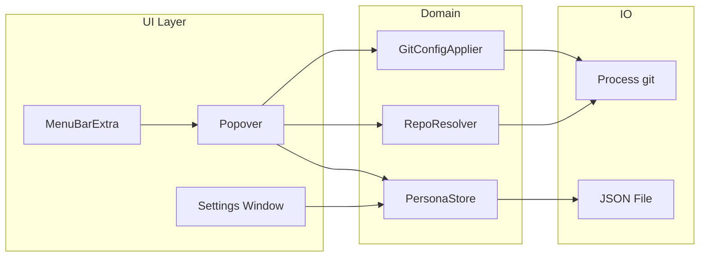
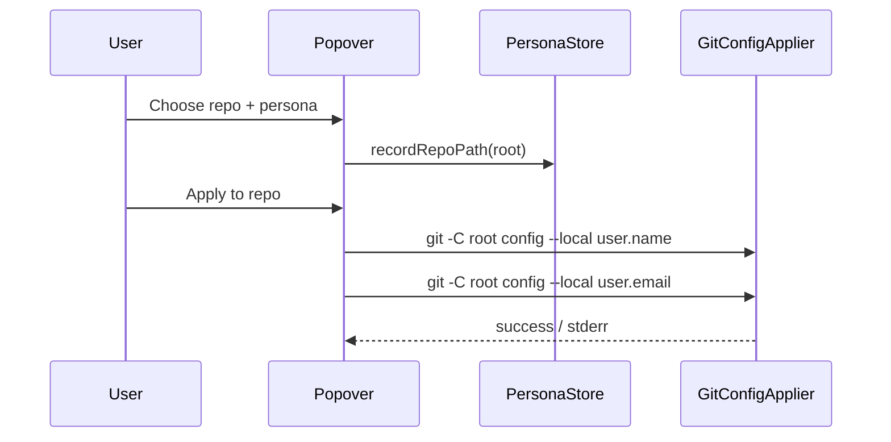
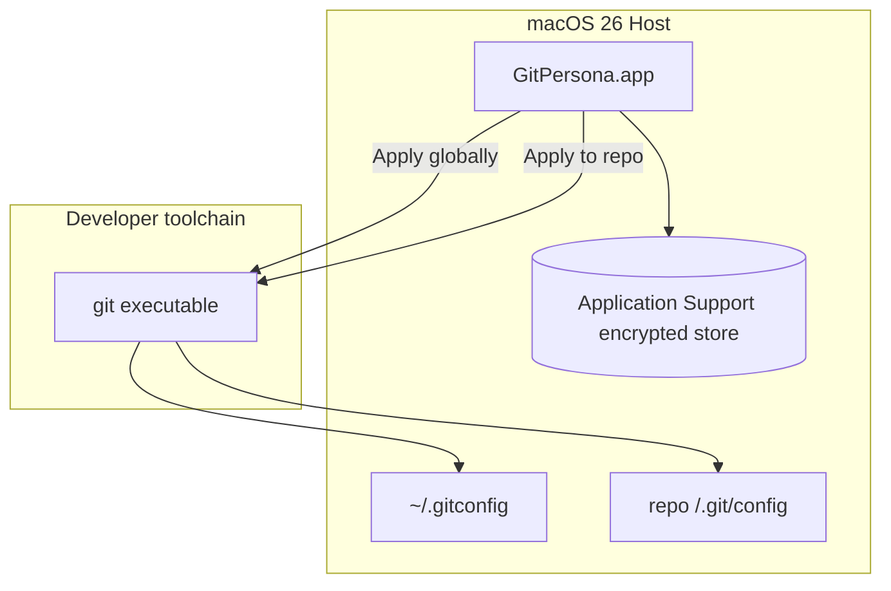

# GitPersona

<p align="center"></p>

<p align="center">
<a href="https://github.com/erbilnas/git-persona/releases"></a>
<a href="https://github.com/erbilnas/git-persona/actions/workflows/build-dmg.yml"></a>
</p>

`GitPersona` — switch `user.name`, `user.email`, and optional `user.signingkey` per repository or globally, from the menu bar.

---

## Requirements

- macOS **26.0** or later  
- **Xcode 26+** (Swift 6, macOS 26 SDK) to build from source  
- **Git** installed and available on your `PATH` (typically `/usr/bin/git` or Xcode Command Line Tools)

## Install (GitHub only — not on the Mac App Store)

GitPersona is **not** distributed through the Mac App Store. Install from GitHub:

### From Releases (recommended)

1. Open the repo’s **[Releases](https://github.com/erbilnas/git-persona/releases)** page.
2. Download `**GitPersona-x.y.z.dmg`** from the release whose tag is `**v*.*.*`** (for example `v1.0.0`). Installable DMGs are attached only to those versioned releases.
3. Open the DMG and drag **GitPersona** into **Applications**.
4. Launch GitPersona from Applications; it appears as a **menu bar** icon (no Dock tile—`LSUIElement`).

### From CI artifacts

Pushes to `**main`** / `**master`** and pull requests run **[Build DMG](.github/workflows/build-dmg.yml)** and upload the `**GitPersona-macos`** workflow artifact (the DMG is still named `GitPersona-<version>.dmg` using the version in the branch). That path does **not** create or update a GitHub Release; use it only when you want an unreleased build from CI.

### Local build

Run `./scripts/build-dmg.sh` on a Mac with Xcode (see [Building & releasing](#building--releasing)). This writes `**dist/GitPersona-<version>.dmg`** and a symlink `**dist/GitPersona.dmg`** pointing at it.

First launch may require allowing the app in **System Settings → Privacy & Security** if Gatekeeper blocks unsigned CI builds. For fewer prompts, add **Developer ID** signing and notarization via repository secrets (see below).

### Release a new version (Changesets)

Releases are **semver-driven** with [Changesets](https://github.com/changesets/changesets): while automation runs, `package.json` holds the version; `**npm run version-packages`** syncs into `[GitPersona/Version.xcconfig](GitPersona/Version.xcconfig)` (`MARKETING_VERSION` + bumped `CURRENT_PROJECT_VERSION`).

1. Install tooling: `npm install`
2. After user-visible work, run `**npm run changeset`**, pick the bump level, and commit the generated file under `.changeset/` with your PR.
3. Merge to `**main`**. The **[Changesets](.github/workflows/changesets.yml)** workflow opens a **Version packages** PR (changelog + version bump + `Version.xcconfig` sync).
4. Merge **Version packages**. The same workflow runs `**npm run release`**, which creates and pushes tag `**v*.*.*`** matching `package.json`.
5. **[Versioned release DMG (post-Changesets)](.github/workflows/versioned-release-after-changesets.yml)** runs after that workflow, builds the DMG, and publishes the **GitHub Release** with `GitPersona-<version>.dmg`. (Tags pushed with the default `GITHUB_TOKEN` do not trigger `**on.push.tags**`, so this follow-up workflow attaches the asset.) If you push a `**v**` tag with credentials that **do** trigger workflows, **[Build DMG](.github/workflows/build-dmg.yml)** publishes the release for that tag instead.

**Manual escape hatch:** you can still tag by hand (`git tag v1.2.3 && git push origin v1.2.3`) if `MARKETING_VERSION` in `Version.xcconfig` already matches the tag—prefer Changesets so `CHANGELOG.md` stays accurate.

`.changeset/config.json` uses `"baseBranch": "main"`. If your default branch is only `master`, change that field to `master`.

## Usage

1. Click the menu bar icon to open the popover.
2. Use **Settings** (gear) to create **personas**—each has a display label, `user.name`, `user.email`, and optional signing key / notes.
3. Choose a **repository** with **Choose…** or pick from **Recent** (recent repo roots are remembered).
4. Select a persona and tap **Apply to repo** (writes **local** `.git/config`) or **Apply globally** (writes `~/.gitconfig` via `git config --global`).

The popover shows read-only previews of **local** and **global** identity as reported by `git config`.

### Limitations (v1)

- Menu bar apps have no shell “current directory”; you **choose** the repo folder explicitly or via recents.  
- SSH keys and remote URLs are **not** switched automatically—only Git identity fields Git stores in config.

## Architecture

### Layered components




| Piece                | Responsibility                                                                                                                                                                                |
| -------------------- | --------------------------------------------------------------------------------------------------------------------------------------------------------------------------------------------- |
| **PersonaStore**     | Loads/saves encrypted `personas.store` (AES-GCM, key in Keychain) under `~/Library/Application Support/dev.gitpersona.app/`. Migrates legacy plaintext `personas.json` once, then removes it. |
| **RepoResolver**     | Runs `git rev-parse --show-toplevel` for a chosen directory to confirm a repo root.                                                                                                           |
| **GitConfigApplier** | Runs `git config` (`--local` / `--global`) to read and write identity fields; resolves `git` via `/usr/bin/git` or `PATH`.                                                                    |


### Apply flow




### Persistence (`personas.store`)

On disk the payload is **encrypted**; the decrypted JSON matches this shape:

```json
{
  "version": 1,
  "personas": [
    {
      "id": "UUID",
      "displayName": "Work",
      "gitUserName": "Ada Lovelace",
      "gitUserEmail": "ada@company.example",
      "signingKey": null,
      "notes": null
    }
  ],
  "lastRepoPaths": ["/path/to/repo"]
}
```

If decryption fails (for example truncated file), the app renames the blob to `personas.store.corrupt-<timestamp>` and falls back to legacy `personas.json` when present.

### Liquid Glass UI

- **Popover header**: on macOS 26+, `.glassEffect(.regular, …)` over a clear shape; otherwise `.bar` material.  
- **Primary actions** (“Apply to repo” / “Apply globally”): wrapped in `GlassChrome.floatingBar`, which applies `.glassEffect(.regular.interactive(), in: .rect(cornerRadius: 14))` on **macOS 26+**, with a material fallback otherwise.  
- **Lists / forms**: plain inset/grouped styling—no glass on dense content.

## System design




The app does **not** open network connections; data stays on disk on your machine.

## Building & releasing

### CI (GitHub Actions)

On each push to `main` / `master` or on pull requests, `[.github/workflows/build-dmg.yml](.github/workflows/build-dmg.yml)` runs `./scripts/build-dmg.sh` and uploads the `**GitPersona-macos`** workflow artifact only (no GitHub Release).

**Versioned releases** with a downloadable DMG:

- After **[Changesets](.github/workflows/changesets.yml)** publishes a `**v**` tag, **[Versioned release DMG (post-Changesets)](.github/workflows/versioned-release-after-changesets.yml)** builds the DMG and creates or updates the **GitHub Release** for that tag.
- A **manually pushed** `**v**` tag that triggers Actions will run **Build DMG** on the tag push and attach the DMG to that release.

`[.github/workflows/changesets.yml](.github/workflows/changesets.yml)` manages **Version packages** PRs and the `**v**` tag after you merge them (see [Release a new version (Changesets)](#release-a-new-version-changesets)).

The workflow uses the `**macos-26`** GitHub-hosted runner (Xcode 26 + macOS 26 SDK), matching the app’s **macOS 26.0** deployment target and Liquid Glass APIs. Do not use `macos-latest` alone unless that label already maps to a macOS 26 image with Xcode 26 in your org.

Optional repository **secrets** for signed / notarized DMGs (same env vars as locally):


| Secret           | Maps to                                  |
| ---------------- | ---------------------------------------- |
| `SIGN_IDENTITY`  | Developer ID Application identity string |
| `NOTARY_PROFILE` | `notarytool` keychain profile name       |


Expose them in the workflow step:

```yaml
env:
  SIGN_IDENTITY: ${{ secrets.SIGN_IDENTITY }}
  NOTARY_PROFILE: ${{ secrets.NOTARY_PROFILE }}
```

(Only add these if you configure secrets; unsigned artifacts still install with user consent in Privacy & Security.)

### Debug / Release build

```bash
cd git-persona
xcodebuild -scheme GitPersona -configuration Release \
  -derivedDataPath ./build/DerivedDataRelease build
```

Product: `build/DerivedDataRelease/Build/Products/Release/GitPersona.app`

### DMG + optional signing / notarization

```bash
./scripts/build-dmg.sh
```

Environment variables:


| Variable         | Purpose                                                                        |
| ---------------- | ------------------------------------------------------------------------------ |
| `SIGN_IDENTITY`  | Apple **Developer ID Application** identity string for `codesign` (app + DMG). |
| `NOTARY_PROFILE` | Keychain profile name created with `xcrun notarytool store-credentials`.       |


Recommended flow for distribution:

1. Archive or build **Release** with **hardened runtime** (already enabled in the project).
2. `codesign` the `.app` with your Developer ID.
3. Build the DMG, sign the DMG.
4. `notarytool submit … --wait`, then `stapler staple` the DMG so Gatekeeper validates offline.

Apple’s notarization docs: [Notarizing macOS software before distribution](https://developer.apple.com/documentation/security/notarizing_macos_software_before_distribution).

## Privacy & security

- **No analytics or network** traffic from the app.  
- **Files touched** only when you apply changes: `~/.gitconfig` and/or `<repo>/.git/config`, plus `~/Library/Application Support/dev.gitpersona.app/personas.store` (Keychain holds the encryption key).  
- Distributed **outside the Mac App Store** with **App Sandbox disabled** so Git can write configs without repeated security prompts typical of sandboxed file access.

## Project layout

```
git-persona/
├── .changeset/
├── .github/workflows/
│   ├── build-dmg.yml
│   ├── changesets.yml
│   └── versioned-release-after-changesets.yml
├── GitPersona.xcodeproj/
├── GitPersona/
│   ├── GitPersonaApp.swift
│   ├── MenuBarPopoverView.swift
│   ├── SettingsView.swift
│   ├── PersonaStore.swift
│   ├── PersonaVault.swift
│   ├── Models.swift
│   ├── GitConfigApplier.swift
│   ├── RepoResolver.swift
│   ├── GlassChrome.swift
│   └── Assets.xcassets/
├── docs/
│   └── logo.svg
├── scripts/
│   ├── build-dmg.sh
│   ├── sync-version-xcconfig.mjs
│   └── push-release-tag.mjs
├── package.json
├── package-lock.json
└── README.md
```

## Troubleshooting


| Issue                       | Suggestion                                                                                                            |
| --------------------------- | --------------------------------------------------------------------------------------------------------------------- |
| “Git executable not found”  | Install Xcode Command Line Tools: `xcode-select --install`.                                                           |
| Apply fails with repo error | Ensure the folder is inside a Git work tree (`git rev-parse` succeeds).                                               |
| Version PR never opens      | Ensure `.changeset/*.md` exists on `main` and **Changesets** workflow has `contents: write` + `pull-requests: write`. |


## License

No license file is bundled by default; add one if you publish the repo publicly.