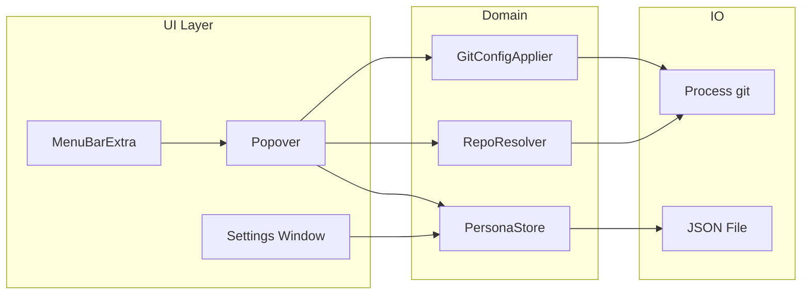
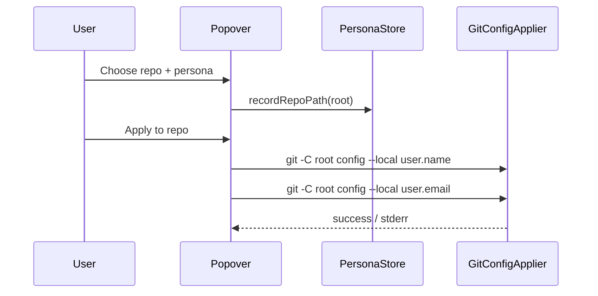
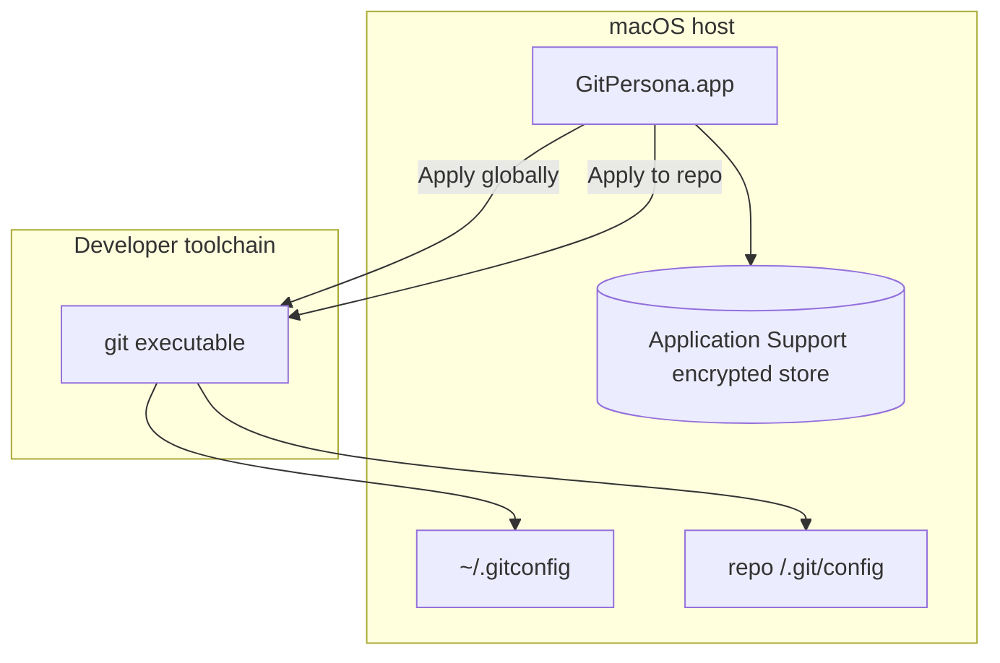

# GitPersona

GitPersona logo

**GitPersona** (`git-persona`) is a minimal macOS menu bar utility for switching Git commit identities—`user.name`, `user.email`, and optional `user.signingkey`—per repository or globally. It targets **macOS 15+** and uses SwiftUI **materials** (for example `.ultraThinMaterial` and `.bar`) on floating chrome so it builds cleanly on **Xcode 16** / the macOS 15 SDK (including GitHub Actions), while staying readable in light and dark mode.

## Requirements

- macOS **15.0** or later  
- **Xcode 16+** (Swift 6, macOS 15 SDK or newer) to build from source  
- **Git** installed and available on your `PATH` (typically `/usr/bin/git` or Xcode Command Line Tools)

## Install (GitHub only — not on the Mac App Store)

GitPersona is **not** distributed through the Mac App Store. Install from GitHub:

### From Releases (recommended)

1. Open the repo’s **Releases** page and download `**GitPersona-x.y.z.dmg`** (for example `**GitPersona-1.0.0.dmg`**) for the release you want (created automatically when a `**v***` tag is pushed, for example `v1.0.0`).
2. Open the DMG and drag **GitPersona** into **Applications**.
3. Launch GitPersona from Applications; it appears as a **menu bar** icon (no Dock tile—`LSUIElement`).

### From CI artifacts

Every push to `**main`** / `**master`** runs **Actions → Build DMG** and uploads the `**GitPersona-macos`** artifact containing the versioned DMG (`GitPersona-x.y.z.dmg`).

### Local build

Run `./scripts/build-dmg.sh` on a Mac with Xcode (see [Building & releasing](#building--releasing)). This writes `**dist/GitPersona-<version>.dmg`** and a symlink `**dist/GitPersona.dmg**` pointing at it.

First launch may require allowing the app in **System Settings → Privacy & Security** if Gatekeeper blocks unsigned CI builds. For fewer prompts, add **Developer ID** signing and notarization via repository secrets (see below).

### Release a new version

1. Edit `**[GitPersona/Version.xcconfig](GitPersona/Version.xcconfig)`** — bump `**MARKETING_VERSION`** for the release (semver) and `**CURRENT_PROJECT_VERSION**` for each shipped build as needed.
2. Commit and push.
3. Tag and push:

```bash
git tag v1.0.1
git push origin v1.0.1
```

The workflow builds the DMG and publishes a **GitHub Release** with `**GitPersona-<MARKETING_VERSION>.dmg`** attached (filename matches the app bundle’s short version string).

Keep the `**v*`** tag aligned with `**MARKETING_VERSION**` (for example tag `v1.0.1` with `MARKETING_VERSION = 1.0.1`) so release tags and binaries stay easy to match.

## Usage

1. Click the menu bar icon to open the popover.
2. Use **Settings** (gear) to create **personas**—each has a display label, `user.name`, `user.email`, and optional signing key / notes.
3. Choose a **repository** with **Choose…** or pick from **Recent** (recent repo roots are remembered).
4. Select a persona and tap **Apply to repo** (writes **local** `.git/config`) or **Apply globally** (writes `~/.gitconfig` via `git config --global`).

The popover shows read-only previews of **local** and **global** identity as reported by `git config`.

### Limitations (v1)

- Menu bar apps have no shell “current directory”; you **choose** the repo folder explicitly or via recents.  
- SSH keys and remote URLs are **not** switched automatically—only Git identity fields Git stores in config.

## Architecture

### Layered components




| Piece                | Responsibility                                                                                                                               |
| -------------------- | -------------------------------------------------------------------------------------------------------------------------------------------- |
| **PersonaStore**     | Loads/saves encrypted `personas.store` (AES-GCM, key in Keychain) under `~/Library/Application Support/dev.gitpersona.app/`. Migrates legacy plaintext `personas.json` once, then removes it. |
| **RepoResolver**     | Runs `git rev-parse --show-toplevel` for a chosen directory to confirm a repo root.                                                          |
| **GitConfigApplier** | Runs `git config` (`--local` / `--global`) to read and write identity fields; resolves `git` via `/usr/bin/git` or `PATH`.                   |


### Apply flow




### Persistence (`personas.store`)

On disk the payload is **encrypted**; the decrypted JSON matches this shape:

```json
{
  "version": 1,
  "personas": [
    {
      "id": "UUID",
      "displayName": "Work",
      "gitUserName": "Ada Lovelace",
      "gitUserEmail": "ada@company.example",
      "signingKey": null,
      "notes": null
    }
  ],
  "lastRepoPaths": ["/path/to/repo"]
}
```

If decryption fails (for example truncated file), the app renames the blob to `personas.store.corrupt-<timestamp>` and falls back to legacy `personas.json` when present.

### SwiftUI chrome

- **Popover header**: standard `.background(.bar)` for readability.  
- **Primary actions** (“Apply to repo” / “Apply globally”): wrapped in `GlassChrome.floatingBar`, which uses `.ultraThinMaterial` in a rounded rectangle so the chrome stays subtle and compiles on the current GitHub Actions toolchain.  
- **Lists / forms**: plain inset/grouped styling—no heavy materials on dense content.

## System design




The app does **not** open network connections; data stays on disk on your machine.

## Building & releasing

### CI (GitHub Actions)

On each push to `main` / `master`, `[.github/workflows/build-dmg.yml](.github/workflows/build-dmg.yml)` runs `./scripts/build-dmg.sh` and uploads the `**GitPersona-macos`** artifact (the built `**GitPersona-x.y.z.dmg**`). Pushing a tag matching `**v***` also creates a **Release** with that DMG attached.

The workflow uses **`macos-latest`** (Xcode 16.x and the macOS 15 SDK). The project’s deployment target is **macOS 15.0**, so no Xcode 26–only APIs are required for CI.

Optional repository **secrets** for signed / notarized DMGs (same env vars as locally):


| Secret           | Maps to                                  |
| ---------------- | ---------------------------------------- |
| `SIGN_IDENTITY`  | Developer ID Application identity string |
| `NOTARY_PROFILE` | `notarytool` keychain profile name       |


Expose them in the workflow step:

```yaml
env:
  SIGN_IDENTITY: ${{ secrets.SIGN_IDENTITY }}
  NOTARY_PROFILE: ${{ secrets.NOTARY_PROFILE }}
```

(Only add these if you configure secrets; unsigned artifacts still install with user consent in Privacy & Security.)

### Debug / Release build

```bash
cd git-persona
xcodebuild -scheme GitPersona -configuration Release \
  -derivedDataPath ./build/DerivedDataRelease build
```

Product: `build/DerivedDataRelease/Build/Products/Release/GitPersona.app`

### DMG + optional signing / notarization

```bash
./scripts/build-dmg.sh
```

Environment variables:


| Variable         | Purpose                                                                        |
| ---------------- | ------------------------------------------------------------------------------ |
| `SIGN_IDENTITY`  | Apple **Developer ID Application** identity string for `codesign` (app + DMG). |
| `NOTARY_PROFILE` | Keychain profile name created with `xcrun notarytool store-credentials`.       |


Recommended flow for distribution:

1. Archive or build **Release** with **hardened runtime** (already enabled in the project).
2. `codesign` the `.app` with your Developer ID.
3. Build the DMG, sign the DMG.
4. `notarytool submit … --wait`, then `stapler staple` the DMG so Gatekeeper validates offline.

Apple’s notarization docs: [Notarizing macOS software before distribution](https://developer.apple.com/documentation/security/notarizing_macos_software_before_distribution).

## Privacy & security

- **No analytics or network** traffic from the app.  
- **Files touched** only when you apply changes: `~/.gitconfig` and/or `<repo>/.git/config`, plus `~/Library/Application Support/dev.gitpersona.app/personas.store` (Keychain holds the encryption key).  
- Distributed **outside the Mac App Store** with **App Sandbox disabled** so Git can write configs without repeated security prompts typical of sandboxed file access.

## Project layout

```
git-persona/
├── GitPersona.xcodeproj/
├── GitPersona/
│   ├── GitPersonaApp.swift
│   ├── MenuBarPopoverView.swift
│   ├── SettingsView.swift
│   ├── PersonaStore.swift
│   ├── PersonaVault.swift
│   ├── Models.swift
│   ├── GitConfigApplier.swift
│   ├── RepoResolver.swift
│   ├── GlassChrome.swift
│   └── Assets.xcassets/
├── docs/
│   └── logo.png
├── scripts/
│   └── build-dmg.sh
└── README.md
```

## Troubleshooting


| Issue                         | Suggestion                                                              |
| ----------------------------- | ----------------------------------------------------------------------- |
| “Git executable not found”    | Install Xcode Command Line Tools: `xcode-select --install`.             |
| Apply fails with repo error   | Ensure the folder is inside a Git work tree (`git rev-parse` succeeds). |
| Settings window does not open | Use the **gear** button in the popover (SwiftUI `Settings` scene).      |


## License

No license file is bundled by default; add one if you publish the repo publicly.